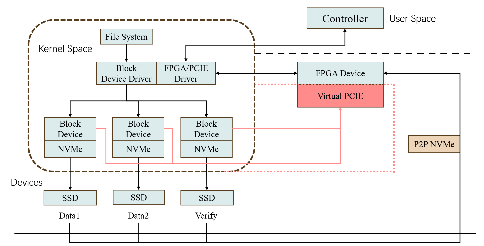

# 虚拟磁盘阵列项目

实现一个 raid4 阵列，校验计算设备为模拟的 pcie 设备。

## 项目架构

项目本身目的是做一个使用外围的 FPGA 或者 GPU 设备进行校验计算的 RAID 阵列，内核创建块设备劫持文件系统发来的 bio 交由驱动程序处理，数据由主机或者外围设备发送给 SSD。本仓库是该项目的纯软件模拟，目的是设计和验证交互协议。虚拟的 pcie 设备由 NVMeVirt[1] 项目的部分代码修改实现。

## 组成

* device：pcie 虚拟设备，模拟的 bar 区域的 layout 为偏移0处是`struct pciev_bar`，偏移 1MB 处三个相邻的 stripe (4kb)，分别代表计算奇偶校验的时候对应的旧数据，新数据，原来的校验数据。运行一个线程`pciev_dispatcher`来执行校验的计算。

* block：面向文件系统的块设备，不使用 muti-queue 机制，直接注册`.submit_bio`接口作为`struct bio`的处理函数，上层调用`submit_bio`函数后会直接调用这个接口不会进入队列机制。将`struct bio`按照 stripe 使用`bio_split`拆分为若干面向单个 nvme 设备的小`struct bio`。如果当前操作为‘写’，则提交小的 bio 之前要修改校验盘对应位置上的校验数据。

* pciedrv：pcie 驱动，校验操作的主要执行模块。接受 bio 参数后，将 bio 中每一段的`struct page`的信息拷贝出来作为新的数据，再读出老的数据和老的校验数据之后拷贝到 bar 区域，通知 device 进行校验计算。

## 流程

校验执行的流程如下：

1. 上级程序提交 bio，被`vpciedisk_submit_bio`函数接收，把大的 bio 分成小的 bio 提交给各个设备。如果为写属性，则在提交给块设备之前提交校验。

2. `pcievdrv_submit_verify`函数遍历 bio 中的每一个段，复制原 bio 并更改属性为 read。为了实现在完成读取操作之前不写入对应区域，避免写入的 bio 先执行，在新建的 bio 的 endio 函数才提交原 bio，将新建的 bio 返回给`pcievdrv_submit_verify`进行提交

3. `pciev_read_bio_endio`是 read 的 bio 的回调函数，该函数会将读到的要写入的分区的原来数据拷贝到新的缓冲页里面，加入 kworker 进行写入 bar 中的计算区域的操作

4. `do_verify_work`是 kworker 的执行函数，他会等待信号量的释放（中断信号中进行），将当前要校验的 chunk 写入前后的数据填入 bar 并且设置 io_num 标志位

5. 中断处理函数中释放信号量, kwork queue 中的一个 worker 会被唤醒。

pciev_dispatcher 的流程：

1. 读取校验盘中的原数据

2. 计算校验

3. 写入校验数据

## 测试和使用

在测试之前，在`/etc/default/grub`中添加一行`GRUB_CMDLINE_LINUX="memmap=1G\\\$5G"`，使物理内存中从5GB开始，1GB的空间不被映射。重启之后使用`sudo cat /proc/iomem`确认是否保留相应地址。

使用`setup.sh`安装模块，该脚本中写入了和上述参数对应的模块参数

子目录中 testbio 是测试提交 bio 的模块；readtest 目录是直接使用 bio 读取 几个 ssd 设备的头部数据到 dmesg 里面的模块，使用 read.sh 脚本读取和 clearhead.sh 清除头部数据，方便调试。如果使用 dd 命令读取的话，会遇到更新不及时的问题，可能是快设备的缓存导致的。

## 问题

高并发写的时候，kworker 因为等待的太多了会爆。加个限制，等待的 worker 较多的时候阻塞一下`vpciedisk_submit_bio`就好了

## 改进方向

将 page 和 bio 的分配都放进 pool 里面进行

## reference

[1] [NVMeVirt](https://github.com/snu-csl/nvmevirt)